# Healthcare Data Analysis 

## 📚 Table of Contents

1. [Project Overview](#1-project-overview)  
2. [Project Description](#2-project-description)  
3. [Key Features](#3-key-features)  
4. [Tools & Technologies](#4-tools--technologies)  
5. [Detailed Overview of Health_Care_EDA in Python](#8-detailed-overview-of-health_care_eda-in-python)  
     &nbsp;&nbsp;&nbsp;&nbsp; 5.1 [Description of the Dataset](#81-description-of-the-dataset)  
     &nbsp;&nbsp;&nbsp;&nbsp; 5.2 [Data Cleaning & Preparation](#82-data-cleaning--preparation)  
       &nbsp;&nbsp;&nbsp;&nbsp;&nbsp;&nbsp;&nbsp;&nbsp; 5.2.1 [Merging All Datasets](#821-merging-all-datasets)  
       &nbsp;&nbsp;&nbsp;&nbsp;&nbsp;&nbsp;&nbsp;&nbsp; 5.2.2 [Standardizing Data](#822-standardizing-data)  
       &nbsp;&nbsp;&nbsp;&nbsp;&nbsp;&nbsp;&nbsp;&nbsp; 5.2.3 [Data Integrity Validation](#823-data-integrity-validation)  
       &nbsp;&nbsp;&nbsp;&nbsp;&nbsp;&nbsp;&nbsp;&nbsp; 5.2.4 [Handling Missing Values](#824-handling-missing-values)  
       &nbsp;&nbsp;&nbsp;&nbsp;&nbsp;&nbsp;&nbsp;&nbsp; 5.2.5 [Handling Duplicates Records](#825-handling-duplicates)  
       &nbsp;&nbsp;&nbsp;&nbsp;&nbsp;&nbsp;&nbsp;&nbsp; 5.2.6 [Converting Datatypes](#826-converting-datatypes)  
       &nbsp;&nbsp;&nbsp;&nbsp;&nbsp;&nbsp;&nbsp;&nbsp; 5.2.7 [Creating Derived Columns](#827-creating-derived-columns)  
       &nbsp;&nbsp;&nbsp;&nbsp;&nbsp;&nbsp;&nbsp;&nbsp; 5.2.8 [Mapping Categorical Values](#828-mapping-categorical-values)  
6. [Exploratory Data Analysis (EDA)](#9-exploratory-data-analysis-eda)  
    &nbsp;&nbsp;&nbsp;&nbsp; 6.1 [Univariate Analysis](#91-univariate-analysis)  
    &nbsp;&nbsp;&nbsp;&nbsp; 6.2 [Bivariate Analysis](#92-bivariate-analysis)  
    &nbsp;&nbsp;&nbsp;&nbsp; 6.3 [Multivariate Analysis](#93-multivariate-analysis)  
    &nbsp;&nbsp;&nbsp;&nbsp; 6.4 [Distribution Analysis](#94-distribution-analysis)  
    &nbsp;&nbsp;&nbsp;&nbsp; 6.5 [Correlation Analysis](#95-correlation-analysis)  
7. [Detailed Overview of HealthCare Power BI Dashboard](#10-detailed-overview-of-power-bi-dashboard)  
    &nbsp;&nbsp;&nbsp;&nbsp; 7.1 [Overview Dashboard](#101-overview-dashboard)  
    &nbsp;&nbsp;&nbsp;&nbsp; 7.2 [Medical Condition & Outcome Analysis](#102-medical-condition--outcome-analysis)  
    &nbsp;&nbsp;&nbsp;&nbsp; 7.3 [Billing & Insurance Analysis](#103-billing--insurance-analysis)  
    &nbsp;&nbsp;&nbsp;&nbsp; 7.4 [Doctor & Hospital Performance](#104-doctor--hospital-performance)  
    &nbsp;&nbsp;&nbsp;&nbsp; 7.5 [Time-Based Analysis](#105-time-based-analysis)

## 📌 1. Project Overview 
&nbsp;&nbsp;&nbsp;&nbsp;This project focuses on analyzing healthcare data to uncover key insights into patient admissions, medical conditions, treatment outcomes, and hospital performance. By combining Python for data preparation and cleaning with Power BI for interactive dashboards, the project aims to support healthcare administrators in making data-driven operational and clinical decisions.

## 📌 2. Project Description 
&nbsp;&nbsp;&nbsp;&nbsp;🩺 The Healthcare Data Analysis and Visualization Project involves working with a multi-sheet Excel dataset containing patient details, hospital information, doctor records, and patient visit data. The project workflow starts with merging and cleaning the data using Python libraries such as Pandas and NumPy in a Jupyter Notebook environment. Key data cleaning steps included handling missing values, standardizing text data, mapping admission type codes, calculating patient length of stay, and identifying high billing cases.

After preparing a clean and integrated dataset, exploratory data analysis (EDA) was performed in Python to validate data distributions and detect anomalies. The prepared dataset was then visualized in Power BI, where a series of interactive dashboards were built to deliver actionable insights.

The dashboards created include:

🔍 **Overview Dashboard** : Patient Admissions Summary: Visualizing patient admission counts, age distribution, gender splits, and admission trends.

🏥 **Medical Condition & Outcome Analysis** : Analyzing the frequency of medical conditions, treatment outcomes, and recovery rates.

💵 **Billing & Insurance Analysis** : Tracking billing amounts, insurance coverage patterns, and flagging high-cost cases.

🧑‍⚕️ **Doctor & Hospital Performance** : Evaluating doctor-wise and hospital-wise patient outcomes, admissions, and billing performance.

📅 **Time-Based Analysis** : Examining trends over time including admissions, discharges, and length of stay patterns.

This project demonstrates how Python-based data engineering can seamlessly integrate with BI tools like Power BI to deliver healthcare insights that improve operational efficiency and patient care decisions.

## 📌 3. Key Features 
- 📑 Merges multiple Excel sheets into a single clean dataset.

- 🧹 Cleans and standardizes patient, doctor, and hospital details.

- ⚙️ Handles missing values (numeric → median, categorical → mode).

- 📏 Calculates Length of Stay for each patient.

- 💸 Flags patients with High Billing Amounts.

- 🔢 Maps Admission Types to numeric codes for analysis.

- 📊 Performs EDA using Python (Pandas, Matplotlib, Seaborn).

- 📈 Builds Power BI dashboards for dynamic visual insights.

## 📌4. Tools & Technologies 

- Python
  - Pandas
  - NumPy
  - Matplotlib
  - Seaborn
- 📊 Power BI
- 📑 Microsoft Excel
- 📓 Jupyter Notebook
- 📂 CSV & Excel Files (for data storage)

## 📌 5. Detailed Overview of HealthCare_EDA in Python 
&nbsp;&nbsp;&nbsp;&nbsp; This notebook begins with a descriptive exploration of the patient and hospital datasets using summary statistics and visual analysis. It then examines patterns in patient demographics, admission types, and medical conditions to understand what factors may influence hospital stay duration. Finally, relationships between variables such as department, billing, and severity of illness are analyzed further.

### 6.1 Description of the Dataset 
&nbsp;&nbsp;&nbsp;&nbsp; The data in the healthcare dataset includes information about patients admitted to hospitals across different medical conditions. It contains 55500 rows and 17 columns, with data spanning several years, starting from 2019. The dataset includes details such as patient ID (P_ID), doctor ID (D_ID), hospital ID (H_ID), medical condition, date of admission, insurance provider, billing amount, room number, admission type, discharge date, medication prescribed, test results, patient name, age, gender, blood type, doctor name, and hospital name.

Key variables in the dataset include medical condition (Cancer, Diabetes, Asthma, Hypertension), billing amount (non-negative real numbers), room number (integer), admission type (Elective, Emergency, Urgent), and medication (Lipitor, Aspirin, Paracetamol). The age and blood type variables are numerical, while gender and insurance provider are categorical variables. The test results vary, with categories like Inconclusive, Abnormal, Normal and NaN values.

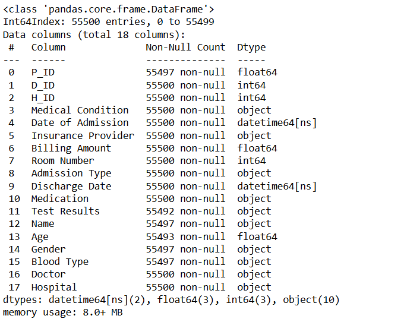

### 6.2 Data Cleaning & Preparation 
&nbsp;&nbsp;&nbsp;&nbsp; Data Cleaning & Preparation is the process of identifying and fixing errors, inconsistencies, and missing values in raw data, transforming it into a structured, reliable, and analysis-ready format for further processing.

#### 6.2.1 Merging All Datasets 
&nbsp;&nbsp;&nbsp;&nbsp; To perform a complete analysis, we merge all four datasets using their respective key columns (**P_ID, D_ID, H_ID**). This helps consolidate **patient details, doctor information, hospital data, and medical history** into a single unified DataFrame for further exploration and visualization.

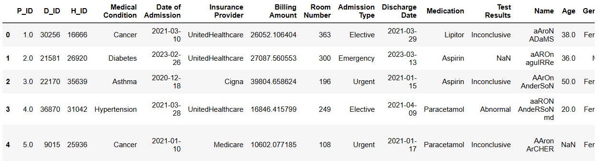

#### 6.2.2 Standardizing Name Fields & Removing Duplicates in merged data 
&nbsp;&nbsp;&nbsp;&nbsp; After merging all datasets, we ensure the `Name`, `Doctor`, and `Hospital` columns are clean and consistently formatted. This helps eliminate redundancy, avoids mismatched values, and improves overall data quality for analysis and visualization.

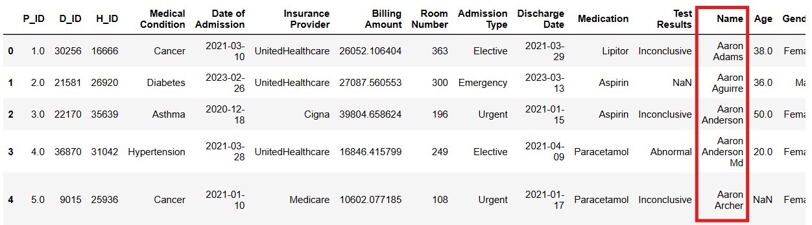

#### 6.2.3 Data Integrity Validation for Foreign Keys (P_ID, D_ID, H_ID) 
Identifying Mismatches and Foreign Key Issues Between P_ID, D_ID, and H_ID in Merged Data and Master Tables

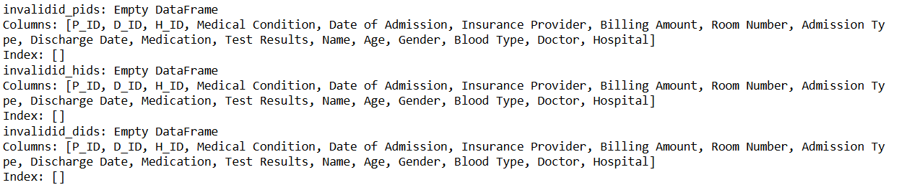

#### 6.2.4 Handling Missing Values 
Identifing and appropriately handling missing values in the dataset to prevent incomplete analysis or errors during visualization.

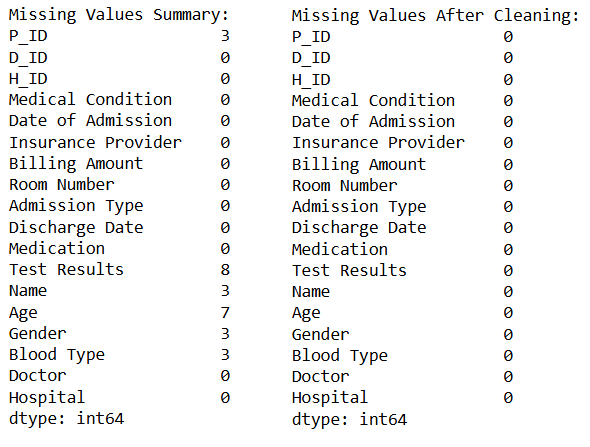

#### 6.2.5 Handling Duplicate Records 
Identifing and appropriately handling missing values in the dataset to prevent incomplete analysis or errors during visualization.

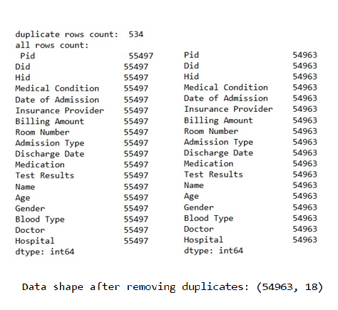

#### 6.2.6 Converting Data Types 
Ensure all columns have correct data types for analysis.

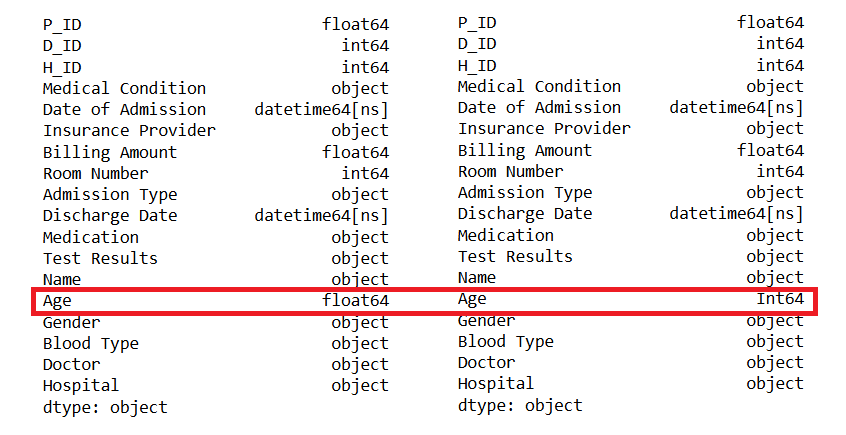

#### 6.2.7 Creating New Derived Columns 
Creating useful new columns like Length of Stay or Billing Category.

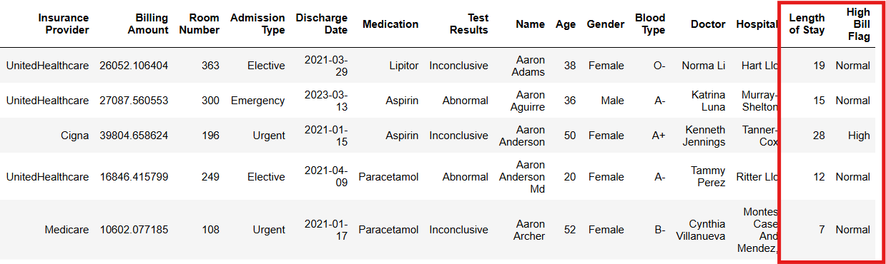

#### 6.2.8 Mapping Categorical Values 
Mapping or encode categorical values for better readability or later modeling.

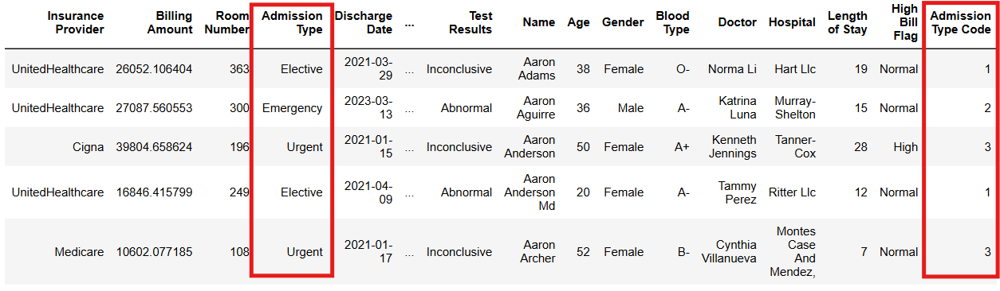

### 📌 7. Exploratory Data Analysis (EDA) 
Creating charts and graphs to make sense of data patterns, trends, relationships, and anomalies visually.

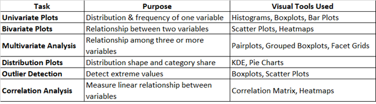

#### 7.1 Univariate Analysis 
&nbsp;&nbsp;&nbsp;&nbsp; Univariate Analysis is the simplest form of data analysis where only one variable is analyzed at a time to understand its distribution, central tendency, spread, and underlying patterns.

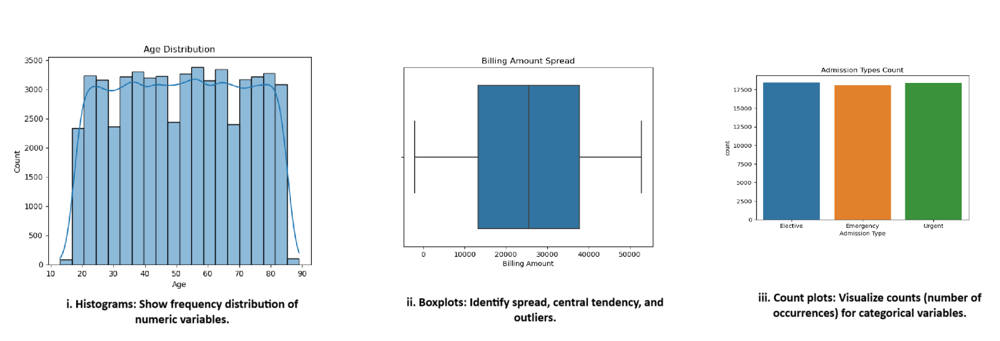

#### 7.2 Bivariate Analysis 
&nbsp;&nbsp;&nbsp;&nbsp;  Bivariate Analysis is the **analysis of two variables simultaneously** to explore the **relationship, association, or correlation** between them and understand how one variable affects or relates to the other.

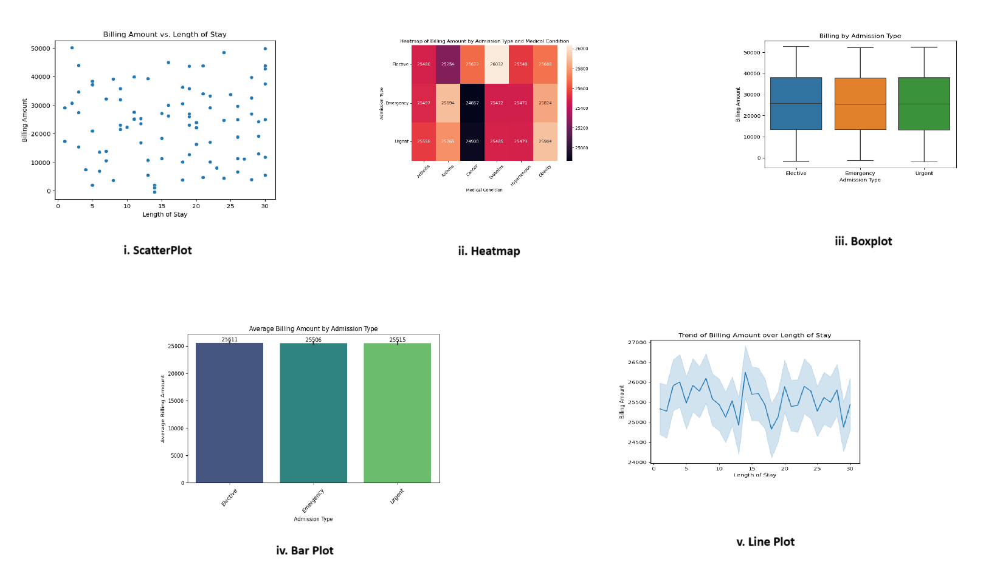

#### 7.3 Multivariate Analysis  
Multivariate Analysis is the *analysis of more than two variables simultaneously* to understand complex relationships, interactions, and combined effects among multiple variables within a dataset.

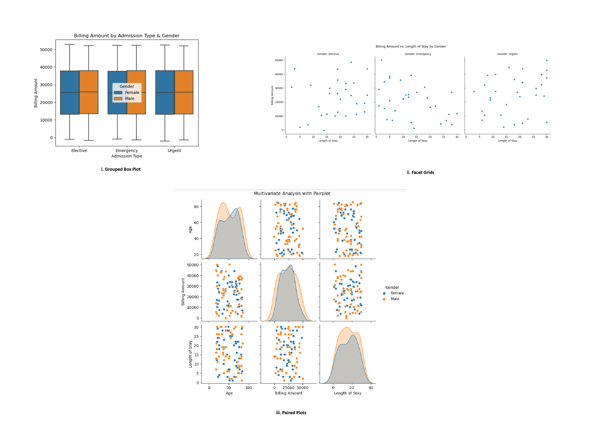

#### 7.4 Distribution Analysis  
Understand data distribution patterns and proportions.

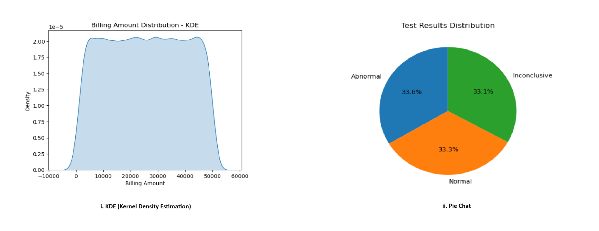

#### 7.5 Correlation Analysis 
*Correlation Heatmap:* Show correlation strength between multiple numeric variables

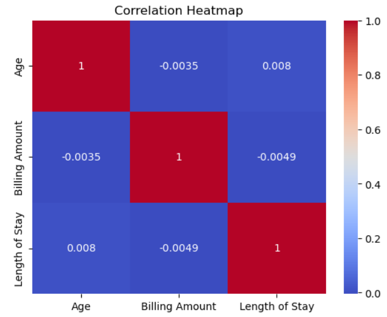

### 📌 8. Detailed Overview of HealthCare Power BI Dashboard 
&nbsp;&nbsp;&nbsp;&nbsp; This comprehensive Power BI Healthcare Admissions & Billing Dashboard offers end-to-end insights into patient admissions, medical conditions, doctor performance, billing trends, and time-based activity. It includes interactive KPI cards, dynamic charts, matrix visuals, and drill-through pages for detailed patient-level analysis. The dashboard empowers stakeholders to monitor hospital operations, financial performance, and clinical outcomes effectively with slicers, bookmarks, and customized timelines for rich, interactive exploration.

#### 🔍 7.1 Overview Dashboard 

**What it does:**
This dashboard provides a quick summary of hospital admissions, patient volumes, and financial performance.

**📊 Visual Insights:**

 - KPI cards display total admissions, average stay, total billing, and avg. billing per patient.

 - Bar chart shows admissions trend by year/month.

 - Donut chart compares Elective vs Emergency admissions.

 - Slicers allow filtering by Year, Gender, and Insurance Provider.

**🎯 Result:**
Quickly monitor hospital activity, identify admission trends, and understand patient distribution by type and demographics at a glance.

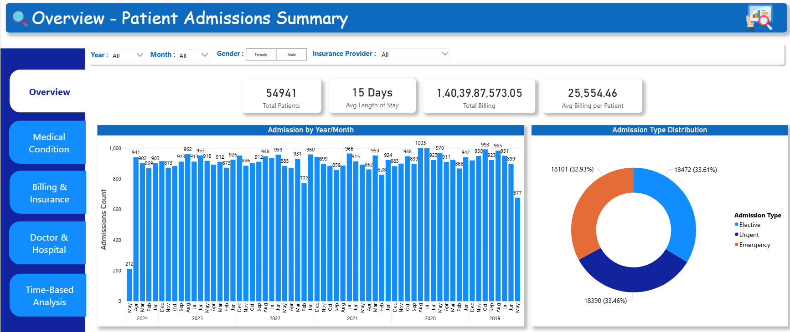

#### 🏥 7.2 Medical Condition & Outcome Analysis 

**What it does:**
This dashboard highlights patient counts by medical condition and their corresponding test outcomes.

**📊 Visual Insights:**

 - Stacked bar chart shows the Top 10 medical conditions by number of patients.

 - Matrix displays the outcome distribution (Normal, Abnormal, Inconclusive) for each condition.

 - Table lists patient details, filterable by condition and doctor using slicers.

**🎯 Result:**
Quickly identify which conditions are most common, how patients are performing in tests, and filter detailed patient lists for deeper analysis.

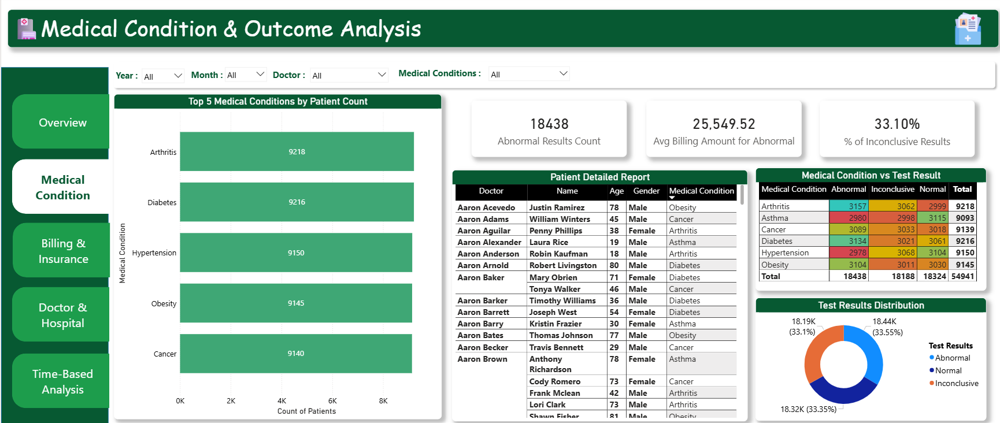

#### 💵 7.3 Billing & Insurance Analysis 

**What it does:**
This dashboard tracks hospital billing patterns, insurance provider contributions, and cost relationships.

**📊 Visual Insights:**

 - Bar chart compares total billing amounts by insurance provider.

 - Line chart shows billing trends over time.

 - Scatter chart visualizes how billing amounts relate to patient length of stay, color-coded by medical condition.

**🎯 Result:**
Easily monitor financial performance, identify top-paying insurers, and spot patterns between costs, patient stays, and conditions.

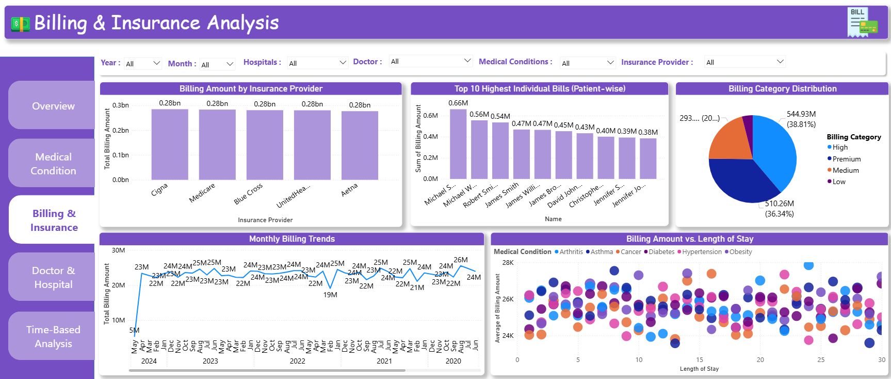

#### 🧑‍⚕️ 7.4 Doctor & Hospital Performance 

**What it does:**
This dashboard evaluates doctor workload, patient outcomes, and hospital-wise admissions.

**📊 Visual Insights:**

 - Table/Matrix shows each doctor’s patient count, average billing, and average length of stay.

 - Bar chart displays number of admissions per hospital.

 - Heat map cross-tabulates doctors with admission types and test results.

**🎯 Result:**
Identify high-performing doctors, hospital patient loads, and how test results vary by doctor and admission type.

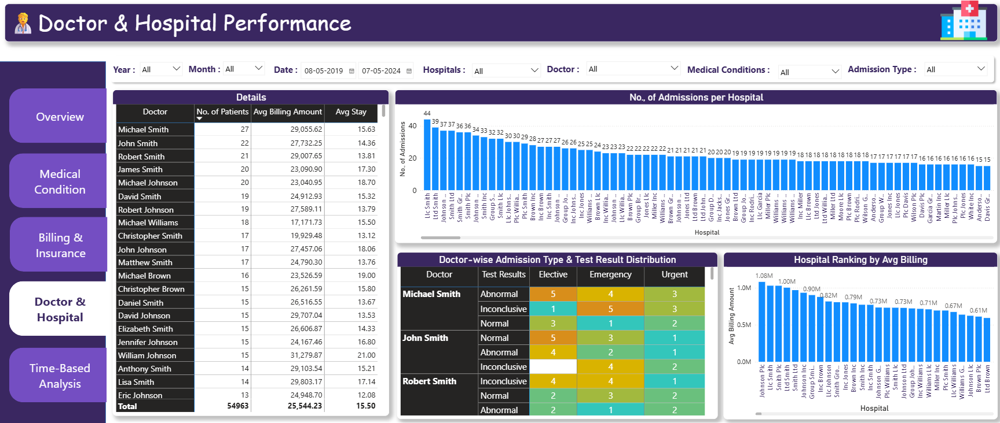

#### 📅 10.5 Time-Based Analysis 

**What it does:**
This dashboard tracks patient admissions over time, helping spot trends and seasonal patterns.

**📊 Visual Insights:**

- Line chart shows admission trends over time.

- Calendar heatmap highlights daily admissions activity.

- Custom timeline (via bookmarks) lets users switch views by Year → Quarter → Month → Date.

- Drill-through pages provide patient-level details from any time point.

**🎯 Result:**
Understand how admissions fluctuate over time, identify peak periods, and drill down to patient records on specific dates for deeper analysis.

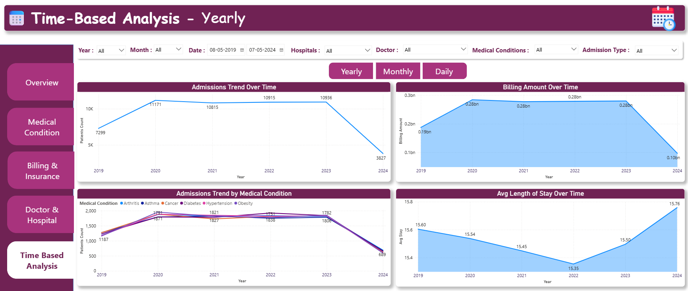

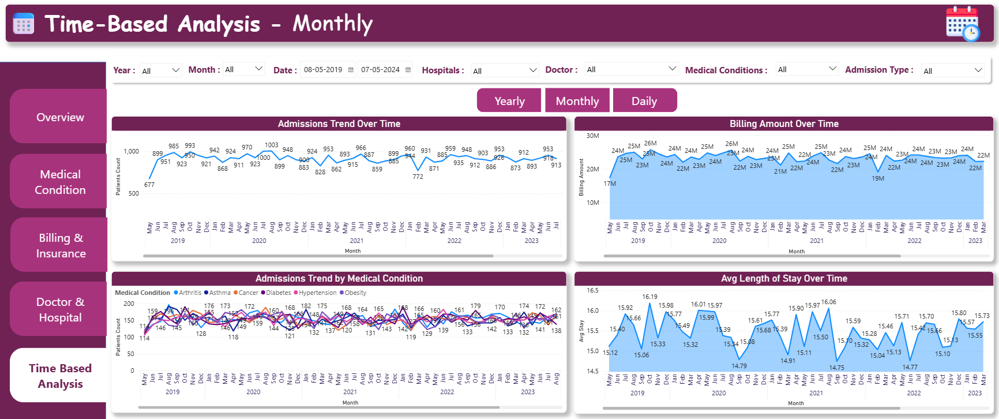

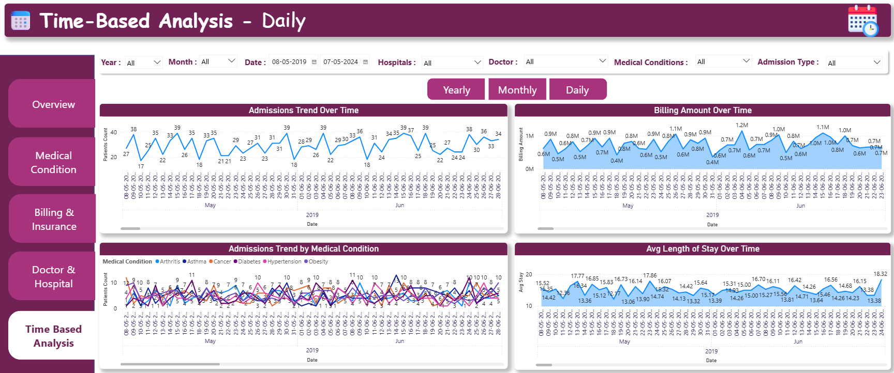

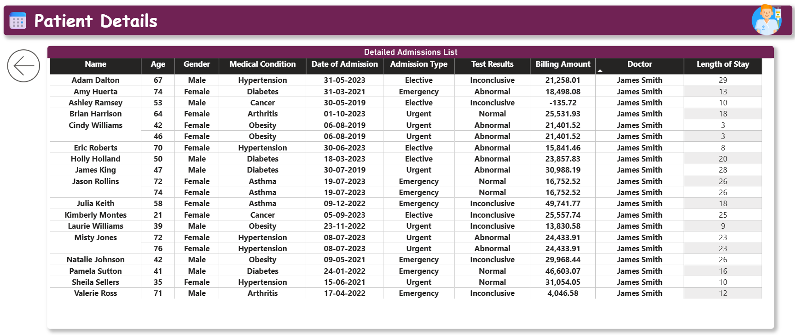
